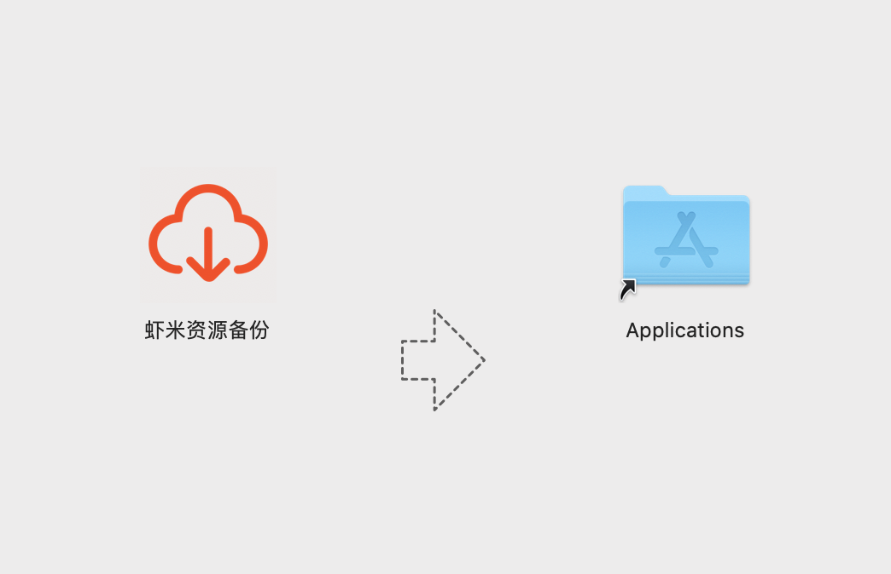
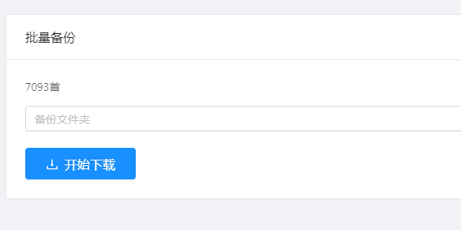
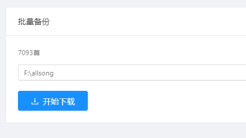
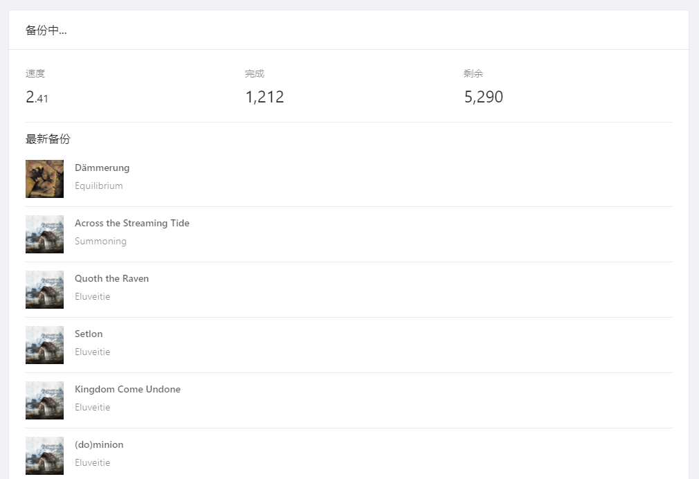

# 备份虾米资源

备份虾米收藏歌曲

## 下载 0.0.4
- [Windows](https://github.com/xiami2021/backup/raw/main/dist/%E8%99%BE%E7%B1%B3%E8%B5%84%E6%BA%90%E5%A4%87%E4%BB%BD%20Setup%200.0.4.exe)  
- [Mac](https://github.com/xiami2021/backup/raw/main/dist/虾米资源备份-0.0.4.dmg)

## 如何使用
> 本机需安装最新虾米桌面客户端、并提前登陆

#### 虾米最新客户端
- [Mac](https://gxiami.alicdn.com/xiami-desktop/update/XiamiMac-05131024-070508.dmg)
- [Windows](https://gxiami.alicdn.com/xiami-desktop/update/%E8%99%BE%E7%B1%B3%E9%9F%B3%E4%B9%90-7.3.0-x86-1225.exe)

识别到具体收藏数量

填入要备份到的文件夹

等待备份完毕

